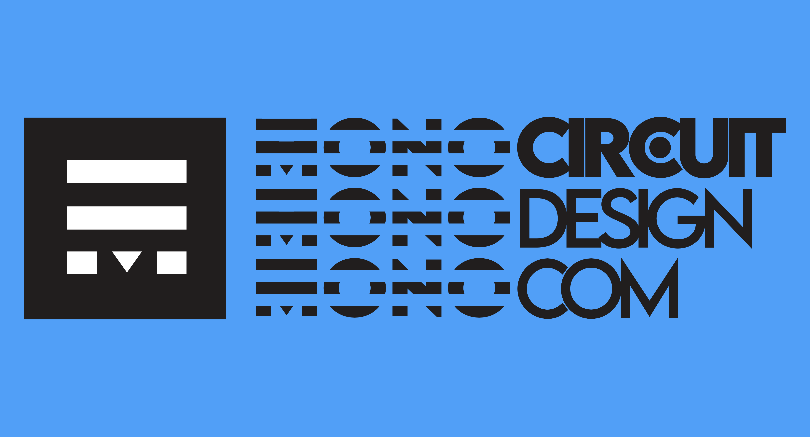
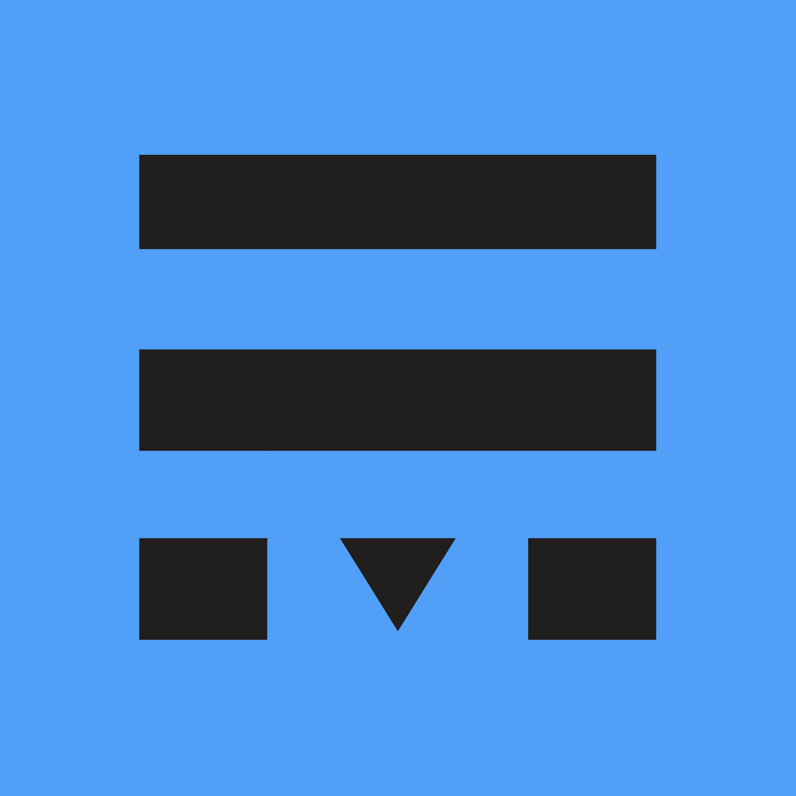

    
     
     
    

     

The design choices of [**@monocircuit**](https://github.com/monocircuit). Where both static and dynamic graphics live. Here every decision regarding the looks of this organization is documented.

 

## Table of Contents

1. [Monocircuit](#Monocircuit)
2. [Hanji](#Hanji)

<h2 align="center">Monocircuit</h2>

Since [**@monocircuit**](https://github.com/monocircuit) is a software organization its designs live in very different environments in terms of since and also of usage, this is why there exist a few variations of the following logo.

### Mentality

The following image is supposed to demonstrate the feel of the design of this organization. It tries to illustrate how the design will work with subproducts, such as hanji.

 

    

### Written Out

This logo can be used when more space is available. It is not suited for anything that is somewhat in a square shape.

 

    

### Favicon

This is for places where the logo must be recognizable in just little space. For example at GitHub's organization logos or favicons for websites.

 

    

